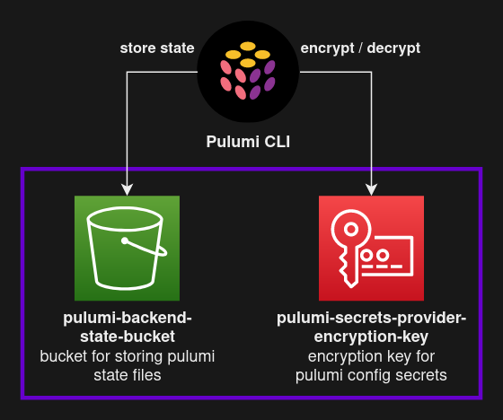

# pulumi-backend-bootstrap
Solve the Chicken and Egg problem: create infrastructure for an AWS self-managed backend for Pulumi (and with Pulumi)

For more details refer to this post: https://justedagain.com/posts/2022/pulumi-backend-bootstrap/



## Prerequisites

- [Install Pulumi](https://www.pulumi.com/docs/get-started/install/)
- [Install Python 3.7+](https://www.pulumi.com/docs/intro/languages/python/)
- Configure [AWS Credentials](https://docs.aws.amazon.com/cli/latest/userguide/cli-configure-quickstart.html) with access to AWS S3 / KMS services.


## Bootstrap

```bash
# use local filesystem as backend
pulumi login --local

# initialize stack
pulumi stack init dev

# set AWS region
pulumi config set aws:region eu-central-1

# deploy stack
pulumi up
```

## Configure Pulumi to use self-managed backend

Note: when using a self-managed backend with multiple Pulumi projects / stacks, it's a good practice to ensure that the stack names are unique and always namespaced with the project name: pulumi stack init <project-name>.<stack-name>. See this [issue](https://github.com/pulumi/pulumi/issues/2814) for more details.

```bash
# Specify the outputs from the bootstraped deployment
export PULUMI_BACKEND_URL="<PULUMI_BACKEND_URL>"
export PULUMI_SECRETS_PROVIDER="<PULUMI_SECRETS_PROVIDER>"
pulumi stack init --secrets-provider="<PULUMI_SECRETS_PROVIDER>" <project-name>.<stack-name>
```
